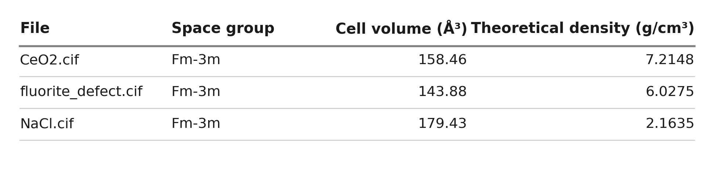

# CIF Density Calculator

[](https://github.com/cristian-galeazzi/CIF-Density-Calculator/actions/workflows/tests.yml)
[](LICENSE)
[](https://www.python.org/downloads/)

Give it a folder of CIF files, the standard output of a crystal-structure
refinement, and it returns the theoretical density of every phase inside them,
as a table you can read and a CSV you can reuse. It runs as a Jupyter notebook,
so no programming experience is needed: open it, drop your files in a folder,
press run.



The table above is the notebook's own output on three synthetic structures
built by [`docs/make_example.py`](docs/make_example.py), so it shows the layout
and no measurement; your own files replace them. The CSV carries the [full set
of columns](docs/output.md), and the notebook table shows the four that matter
at a glance.

## Quick start

No terminal required. If Python and a notebook editor are already set up, start
at step 3.

1. **Install Python** (version 3.11 or newer). On Windows, download the
   installer from [python.org](https://www.python.org/downloads/) and tick **Add
   python.exe to PATH** on the first screen; that checkbox is easy to miss and
   everything else assumes it. macOS and Linux usually ship a suitable Python
   already.

2. **Install a notebook editor.** [VS Code](https://code.visualstudio.com/) is
   free, works the same on Windows, macOS and Linux, and needs its Python and
   Jupyter extensions, which it offers to install the first time you open a
   notebook.

3. **Download this repository**: the green *Code* button above, then *Download
   ZIP*, then unzip it somewhere you can find again.

4. **Open `CIF_Density_Calculator.ipynb`** in VS Code, put your `.cif` files in
   the `cif_files/` folder next to it, and press *Run All*.

You end up with this layout. You add files to `cif_files/` only:

```
CIF_Density_Calculator.ipynb   <- the three cells you run
cif_density.py                 <- the engine, imported by the notebook
test_cif_density.py            <- the validation suite
cif_files/                     <- your .cif files go here
density_results.csv            <- written on each run
```

The first cell installs pymatgen and pandas if they are missing, so there is
nothing to install by hand. Results appear as a table under the last cell and
are written to `density_results.csv` in the same folder, which opens in Excel or
any spreadsheet. From a terminal, `pip install -r requirements.txt` does the
same in one step. Tested on Python 3.11 and 3.14, with pymatgen 2026.5.4 and
pandas 3.0.3.

The notebook has three cells: setup, an optional self-check against one
synthetic NaCl structure, and the batch run, which processes every CIF in
`cif_files/` and writes the CSV. `INPUT_FOLDER` and `OUTPUT_CSV`, set in the
last cell, default to `"cif_files"` and `"density_results.csv"`.

> [!TIP]
> In VS Code, *Select Kernel* at the top right chooses which Python runs the
> notebook. A package looks missing right after it installed? The notebook is
> almost always running on a different Python than the one that received it.
> Pick the other kernel and run again. Keep `cif_density.py` in the same folder
> as the notebook: the notebook imports the calculation from it rather than
> containing it, so on its own it does nothing. Downloading the ZIP keeps them
> together.

> [!WARNING]
> **Google Colab means uploading your structures to Google.** Every CIF dragged
> into the Files sidebar leaves your machine and is processed on someone else's
> infrastructure, which an embargo, a group policy or a collaboration agreement
> may not allow. Check before you upload, not after. Colab suits published or
> synthetic structures; for your own unpublished ones, run locally instead.
> If that is settled, upload **both** `CIF_Density_Calculator.ipynb` (through
> *File -> Upload notebook*) and `cif_density.py` (through the *Files* sidebar),
> run all cells, then drag your CIF files into the `cif_files` folder it creates
> and re-run the last cell.

## What you get

One row per phase in `density_results.csv`. The theoretical density comes
second, straight after the file name, because it is the result the file exists
for; everything after it is context. The notebook table shows four of the
columns, rounded for reading:

| Column | Content |
|--------|---------|
| `File` | Source file name (with the phase index for multi-phase files) |
| `Space group` | International (Hermann-Mauguin) symbol |
| `Cell volume (ų)` | Unit-cell volume |
| `Theoretical density (g/cm³)` | The result |

The CSV carries all seventeen columns at 4 decimal places, including the
unreduced cell composition, lattice parameters, `Z` and the cell mass. **Full
column contract, and why the composition is not reduced:**
[docs/output.md](docs/output.md).

## What it accepts

Standard crystallographic CIF files; any block that defines a unit cell is
processed, including multi-block Rietveld exports (GSAS-II), multi-phase files,
partial occupancies, and both symmetry-expanded and explicit P1 atom lists.
Malformed files are isolated in a separate error table and never stop the batch.

Full contract: [docs/input-format.md](docs/input-format.md).

## Limitations

- **It computes the theoretical density, not a measured one.** Also called the
  crystallographic or X-ray density: the mass of the refined unit cell divided
  by its volume. It does not compute *relative* density (measured / theoretical),
  which would need an experimental value, e.g. from Archimedes weighing.
- **The arithmetic does not know what produced the cell.** A structure refined
  from neutron data or relaxed by DFT is treated identically, which is why the
  IUCr core dictionary stores this as `_exptl_crystal_density_diffrn` rather than
  under an X-ray-specific name.
- **It cannot check a refinement against reality.** A wrong occupancy in the CIF
  becomes a wrong density, silently. One case is caught: an element declared but
  never placed is reported, since that leaves the density too low. The arithmetic
  is validated; the crystallography remains yours.

## Validation

[`test_cif_density.py`](test_cif_density.py) generates six synthetic structures
at run time and runs the whole pipeline on them, checking two tolerances:
internal self-consistency (< 10⁻⁸ relative) and accuracy (< 0.2 % relative,
against densities hand-calculated from IUPAC standard atomic weights,
independent of pymatgen). Run it with a bare `pytest`, or run the notebook,
which carries its own self-check. CI runs it on every push.

Method, precision notes and the full test-case table:
[docs/validation.md](docs/validation.md).

## Privacy

> [!CAUTION]
> No experimental or personal data is in this repository, and none must ever be
> committed or published.

`cif_files/`, `*.cif` and `*.csv` are excluded by [`.gitignore`](.gitignore),
the validation suite and the notebook self-check use only synthetic structures,
and notebook outputs (which embed file names) are stripped before every commit.

Full procedure, including automatic output stripping with nbstripout:
[docs/privacy.md](docs/privacy.md).

## How to cite

See [`CITATION.cff`](CITATION.cff) (GitHub shows a "Cite this repository"
button). For a permanent, versioned DOI, archive a tagged release on
[Zenodo](https://zenodo.org).

Please also cite the libraries this notebook relies on:

- S. P. Ong *et al.*, "Python Materials Genomics (pymatgen): A robust,
  open-source python library for materials analysis", *Comput. Mater. Sci.*
  **68**, 314-319 (2013),
  doi:[10.1016/j.commatsci.2012.10.028](https://doi.org/10.1016/j.commatsci.2012.10.028)
- A. Togo & I. Tanaka, "Spglib: a software library for crystal symmetry
  search", [arXiv:1808.01590](https://arxiv.org/abs/1808.01590) (2018)

Reference data used by the validation section:

- IUPAC Commission on Isotopic Abundances and Atomic Weights, *Standard atomic
  weights of the elements 2021*
- BIPM, *The International System of Units (SI)*, 9th edition (2019) - exact
  value of the Avogadro constant

## AI assistance

This software was developed with the assistance of Claude (Anthropic): the
initial version with Claude Fable, later revisions with Claude Opus. Every
change was supervised and reviewed by the author, who remains solely responsible
for the method, the validation suite and any result published using this
software.

## License

MIT - see [`LICENSE`](LICENSE).
